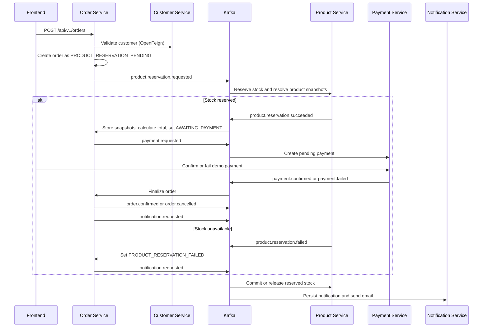

<div align="center">


  # Saga E-commerce Microservices Platform

  **A full-stack e-commerce demo built around Spring Boot 4 microservices, Kafka messaging, Keycloak security, Docker and a Saga-style order workflow.**


</div>


<!-- TABLE OF CONTENTS -->
<details>
  <summary>Table of Contents</summary>
  <ol>
    <li>
      <a href="#overview">Overview</a>
    </li>
    <li>
      <a href="#architecture">Architecture</a>
      <ul>
        <li><a href="#request-flow">Request Flow</a></li>
      </ul>
    </li>
    <li>
      <a href="#technical-highlights">Technical Highlights</a>
    </li>
    <li>
      <a href="#backend-design-and-consistency-model">Backend Design and Consistency Model</a>
      <ul>
        <li><a href="#service-boundaries">Service Boundaries</a></li>
        <li><a href="#persistence-model">Persistence Model</a></li>
        <li><a href="#local-transactions-and-eventual-consistency">Local Transactions and Eventual Consistency</a></li>
        <li><a href="#idempotency">Idempotency</a></li>
        <li><a href="#observability">Observability</a></li>
      </ul>
    </li>
    <li>
      <a href="#order-processing-saga">Order Processing Saga</a>
      <ul>
        <li><a href="#order-lifecycle">Order Lifecycle</a></li>
        <li><a href="#product-reservation-flow">Product Reservation Flow</a></li>
        <li><a href="#payment-flow">Payment Flow</a></li>
        <li><a href="#saga-outcomes-and-compensation">Saga Outcomes and Compensation</a></li>
        <li><a href="#kafka-topics-and-events">Kafka Topics and Events</a></li>
      </ul>
    </li>
    <li>
      <a href="#security-model">Security Model</a>
    </li>
    <li>
      <a href="#repository-layout">Repository Layout</a>
    </li>
    <li>
      <a href="#run-locally">Run Locally</a>
      <ul>
        <li><a href="#prerequisites">Prerequisites</a></li>
        <li><a href="#1-start-infrastructure">1. Start Infrastructure</a></li>
        <li><a href="#2a-run-everything-with-docker">2A. Run Everything With Docker</a></li>
        <li><a href="#2b-run-services-locally-for-development">2B. Run Services Locally For Development</a></li>
      </ul>
    </li>
    <li>
      <a href="#useful-local-urls">Useful Local URLs</a>
    </li>
    <li>
      <a href="#configuration">Configuration</a>
    </li>
    <li>
      <a href="#api-documentation">API Documentation</a>
    </li>
    <li>
      <a href="#frontend-scope">Frontend Scope</a>
    </li>
    <li>
      <a href="#testing">Testing</a>
    </li>
    <li>
      <a href="#engineering-trade-offs">Engineering Trade-offs</a>
    </li>
    <li>
      <a href="#deployment-notes">Deployment Notes</a>
    </li>
  </ol>
</details>

## Overview

<div align="center">
  <video controls width="70%" src="https://github.com/user-attachments/assets/8db52c1d-f08d-42b9-8e89-26ccb805d2cc" type="video/mp4"></video>
  Watch Saga happy path demo
</div>

This repository is a portfolio oriented e-commerce system that focuses on distributed backend architecture rather than storefront polish. It includes a React operations console, an API Gateway, service discovery and centralized configuration, role-based security with Keycloak, database persistence per service, Kafka-based integration events, local observability tooling, and tests around the core business flow.

The main workflow is an **event driven, orchestrated Saga** for order processing. Order Service owns the lifecycle, Product Service owns stock and product snapshots, Payment Service owns payment state, and Notification Service reacts to final business events.

> [!NOTE]
> The frontend is intentionally an admin/demo console, not a consumer shop. Its purpose is to make the distributed workflow visible: create an order, watch product reservation complete, inspect the payment, confirm or fail it, and observe the final order state.

### Saga Fail and Compensation Demo
The saga route guides through the happy path, and also simulates a payment failure to show how the Saga rolls back product reservations and notifies the customer. The video below shows that flow end to end, including the compensation step after payment failure.

<div align="center">
  <video controls width="70%" src="https://github.com/user-attachments/assets/f79526ac-80ce-481c-9757-dc1ba5cab2c3" type="video/mp4"></video>
  Watch Saga failure and compensation demo
</div>

## Architecture


The backend is split into independently bounded services under `services/`. The frontend lives separately under `frontend/` and talks only to the Gateway.

| Component | Responsibility | Runtime data |
| --- | --- | --- |
| `Frontend` | Vite/React admin console for catalog, customers, orders, and Saga demo | Browser session only |
| `API Gateway` | Spring Cloud Gateway, OAuth2 Login BFF, TokenRelay, route authorization | In-memory Spring WebSession |
| `Config Server` | Centralized Spring Cloud Config using bundled native YAML files | Configuration files |
| `Discovery` | Eureka service registry | Registered service instances |
| `Customer` | Customer CRUD and customer validation | MongoDB |
| `Product` | Catalog, stock adjustments, reservation, stock compensation | PostgreSQL + Flyway |
| `Order` | Order API and Saga orchestration | PostgreSQL |
| `Payment` | Payment records and demo confirm/fail actions | PostgreSQL |
| `Notification` | Notification persistence and email delivery through MailDev | MongoDB + SMTP |

Infrastructure is provided by Docker Compose: PostgreSQL, MongoDB, Kafka, Keycloak, MailDev, Zipkin, pgAdmin, and Mongo Express.

## Technical Highlights

- **Gateway managed browser authentication**: the Gateway uses Spring Security OAuth2 Login against Keycloak and stores tokens server side. React receives only an HttpOnly `SESSION` cookie.
- **Stateless downstream services**: domain services validate relayed JWT access tokens as OAuth2 Resource Servers.
- **Role aware routing**: product reads are public; product mutations require Admin; customer routes require Customer Support or Admin; order/payment inspection requires Order Manager or Admin.
- **Event driven consistency**: Kafka carries business events between Order, Product, Payment, and Notification services instead of distributed transactions.
- **Owned persistence**: each domain service owns its database schema or collection. Product uses Flyway and `ddl-auto: validate`; Order and Payment use JPA schema updates for local demo speed.
- **Operational frontend**: the UI exposes real backend state, role restrictions, local dev tools, order flow polling, and payment demo actions.
- **Local observability**: Zipkin receives tracing spans and MailDev captures notification emails.

## Backend Design and Consistency Model

The backend is intentionally split by business capability, not by technical layer. Each service owns the state it can change safely inside one local transaction, and other services learn about those changes through events. That keeps the service boundaries clear and avoids pretending that a distributed checkout can be made atomic with a single database transaction.

### Customer Service
`customer-service` stores customer documents in MongoDB and exposes customer CRUD plus lookup by ID. `order-service` calls it synchronously through OpenFeign only during order creation, because the order cannot even start without a valid customer snapshot. The Feign client is named `customer-service`, so Eureka resolves the instance, and `FeignSecurityConfig` propagates the current Bearer token to the downstream call.

### Product Service
`product-service` owns the product catalog, available stock, reserved stock, categories, and reservation records. It uses PostgreSQL with Flyway migrations: `V1__init_database.sql` creates `category` and `product`, `V2__seed_data.sql` seeds the hardware catalog, and `V3__add_product_reservations.sql` adds `reserved_quantity` plus the `product_reservation` table. JPA runs with `ddl-auto: validate`, so schema drift is caught instead of silently created at runtime.

### Order Service
`order-service` owns `customer_order` and order lines in PostgreSQL. It stores the requested product IDs and quantities first, then applies Product Service snapshots later when stock has been reserved. The order total starts at zero and is recalculated only from confirmed `ProductReservationItem` prices. Order and Payment use `ddl-auto: update` in this local demo to reduce migration overhead while iterating.

### Payment Service
`payment-service` owns payment records in PostgreSQL. A `payment.requested` event creates a `PENDING` payment with reference `PAY-<orderReference>`. The demo endpoints then move that payment to `CONFIRMED` or `FAILED` and publish the matching integration event. `notification-service` stores notification documents in MongoDB and sends emails through MailDev from `notification.requested` events; it has no public Gateway route.

### Transactions and Eventual Consistency
Local transactions are used where they matter most. Product reservation locks product rows with `findAllByIdInOrderByIdForUpdate`, subtracts from `availableQuantity`, increments `reservedQuantity`, and writes `ProductReservation` rows in one Product Service transaction. Order event handling locks the order aggregate with `findByIdForUpdate` before applying Saga transitions, preventing competing Kafka events for the same order from both observing the same prior state. Payment updates and notification persistence are also local to their owning service.

There is no XA transaction, two phase commit, transactional outbox, or shared database. Kafka publish calls are made from service code, so database writes and event publication are not wrapped in a single atomic outbox commit. For this project that trade-off keeps the architecture readable and demonstrates the Saga mechanics directly; in a production grade version, the next hardening step would be an outbox/inbox pattern, retry/DLQ policy, and stronger event deduplication.

### Observability: Zipkin Tracing
Zipkin tracing is enabled across services through Micrometer/Brave and exported to `http://localhost:9411`. That matters in this system because a single user action crosses the Gateway, one synchronous Feign call, several Kafka topics, and multiple databases. When a Saga stalls, traces plus service logs make it possible to identify whether the failure is in customer validation, product reservation, payment creation, or final compensation.

## Order Processing Saga

Order processing is an **orchestrated Saga**. Order Service is the orchestrator and decides the next step based on events from Product and Payment services.



The important design choice is that Product Service returns product names and confirmed prices in `product.reservation.succeeded`. Those snapshots become the source of truth for the order total and payment amount. Order Service does not synchronously fetch products or recalculate prices from a remote catalog during order creation.

Kafka topics are provisioned by `docker/kafka/create-topics.sh` from `docker/kafka/topics.env` with broker auto topic creation disabled.

### Order States

The Order aggregate has five public states in `OrderStatus`:

| State | Trigger | Meaning |
| --- | --- | --- |
| `PRODUCT_RESERVATION_PENDING` | `POST /api/v1/orders` succeeds after customer validation | The order exists, but product names, prices, total amount, and payment are not resolved yet. |
| `AWAITING_PAYMENT` | `product.reservation.succeeded` is consumed | Product snapshots have been stored, the total amount has been calculated, and `payment.requested` has been published. |
| `CONFIRMED` | `payment.confirmed` is consumed | Payment succeeded. Order Service publishes `order.confirmed` for stock commit and `notification.requested` for email. |
| `PRODUCT_RESERVATION_FAILED` | `product.reservation.failed` is consumed | Stock could not be reserved or a requested product was invalid. Payment is never requested. |
| `PAYMENT_FAILED` | `payment.failed` is consumed | Product stock had been reserved, but payment failed. Order Service publishes `order.cancelled` so Product Service can release stock. |

`order.cancelled` is deliberately an integration event, not an internal `OrderStatus`. Internally the failure remains explicit as `PAYMENT_FAILED`, while Product Service receives a clear compensation signal.

### Events and Compensation

Kafka is the integration layer between domain services. The topics are configured centrally and created by the local Kafka init container:

| Topic | Producer | Consumer | Purpose |
| --- | --- | --- | --- |
| `product.reservation.requested` | Order Service | Product Service | Ask Product Service to reserve stock for an order. |
| `product.reservation.succeeded` | Product Service | Order Service | Return reserved product snapshots and confirmed prices. |
| `product.reservation.failed` | Product Service | Order Service | Stop the Saga before payment and notify the customer. |
| `payment.requested` | Order Service | Payment Service | Create a pending payment for the confirmed order amount. |
| `payment.confirmed` | Payment Service | Order Service | Finalize the order successfully. |
| `payment.failed` | Payment Service | Order Service | Mark payment failure and start stock compensation. |
| `order.confirmed` | Order Service | Product Service | Commit reserved stock after payment success. |
| `order.cancelled` | Order Service | Product Service | Release reserved stock after payment failure. |
| `notification.requested` | Order Service | Notification Service | Persist and send order outcome emails. |

#### Successful Flow
On the successful path, Product Service changes stock from available to reserved, Order Service calculates the total from the reservation success event, Payment Service creates a `PENDING` payment, and the demo confirmation endpoint publishes `payment.confirmed`. Order Service then marks the order `CONFIRMED`, emits `order.confirmed`, and Product Service converts matching `ProductReservation` rows from `RESERVED` to `COMMITTED` while reducing `reservedQuantity`.

#### Failure Flow
When product reservation fails, Product Service publishes `product.reservation.failed` without changing stock. Order Service moves the order to `PRODUCT_RESERVATION_FAILED` and emits `notification.requested`; it does not emit `payment.requested` or `order.cancelled` because no stock was reserved.

When payment fails, Order Service moves the order to `PAYMENT_FAILED`, publishes `order.cancelled`, and emits `notification.requested`. Product Service handles `order.cancelled` by finding `RESERVED` rows for that order, changing them to `RELEASED`, decrementing `reservedQuantity`, and adding the quantity back to `availableQuantity`.

#### Idempotency and Duplicate-Event Handling
Idempotency is implemented where the current workflow most needs it, but it is not a complete exactly once system. Order creation is idempotent by `reference` only when the repeated request matches the existing customer, payment method, and aggregated product quantities; a different request with the same reference is rejected. Product reservation checks existing `ProductReservation` rows by `orderId` and returns the previous success shape instead of reserving stock again. Final stock commit/release ignores reservations that are no longer `RESERVED`. Order event handlers also ignore some already terminal states, and payment demo confirm/fail calls return safely if the payment is already in the requested state.

The limits are also explicit. There is no Kafka inbox table, no message offset table, no outbox, and no global deduplication key across every consumer. A duplicate `payment.requested` can still hit the database unique constraint on `paymentReference`, and publish/commit atomicity is not guaranteed. Those are the right next problems to solve if this moves beyond a local portfolio system.

## Security Model

The local realm is imported from `docker/keycloak/ecommerce-realm.json`. Registration is disabled and the demo has exactly three users:

| Username | Password | Roles |
| --- | --- | --- |
| `admin` | `admin` | `ROLE_ADMIN`, `ROLE_ORDER_MANAGER`, `ROLE_CUSTOMER_SUPPORT` |
| `orders` | `orders` | `ROLE_ORDER_MANAGER` |
| `support` | `support` | `ROLE_CUSTOMER_SUPPORT` |

Browser login starts at `GET /auth/login`. The Gateway redirects to Keycloak, completes the Authorization Code flow server-side, stores the authorized client in the Gateway session, and redirects back to the frontend.

> [!IMPORTANT]
> The frontend must not store OAuth2 tokens. There is no `keycloak-js`, no JWT in `localStorage`, and no frontend-managed `Authorization` header. API calls use `credentials: "include"` so the Gateway can use its HttpOnly session cookie and relay the access token downstream.

> [!WARNING]
> CSRF is disabled in the Gateway for this local/demo iteration. The current mitigation is an HttpOnly `SESSION` cookie, `SameSite=Lax`, and strict CORS for the configured frontend origin. Re-enable CSRF or add equivalent protection before using this security model outside a controlled demo environment.

## Repository Layout

```text
.
|-- docker/                         # Keycloak realm, Kafka topic init, Postgres database init
|-- docs/                           # API docs, frontend design docs, Saga documentation, ADRs
|-- frontend/                       # Vite + React + TypeScript operations console
|-- services/                       # Multi-project Gradle backend workspace
|   |-- config-server/
|   |-- discovery/
|   |-- gateway/
|   |-- customer/
|   |-- product/
|   |-- order/
|   |-- payment/
|   `-- notification/
|-- docker-compose.infra.yml        # Databases, Kafka, Keycloak, MailDev, Zipkin, admin UIs
`-- docker-compose.services.yml     # Built application images and frontend container
```

## Prerequisites

- Docker Desktop or compatible Docker Engine with Compose
- Java 21 if running services locally
- Bun if running the frontend locally
- A shell that can run the Gradle wrapper scripts under `services/`
- Around 6Gb of free ram for the full stack, especially with multiple services running locally

No root Gradle wrapper exists. Backend commands run from `services/`; frontend commands run from `frontend/`.

## Run Locally

The project supports two workflows. Docker is the most reproducible option; local Gradle/Bun is more convenient while developing.

### 1. Start Infrastructure

Both workflows need the shared Docker network and infrastructure services first.

```bash
docker network create ecommerce-network
docker compose -f docker-compose.infra.yml up -d
```

If the network already exists, Docker will report that and you can continue.

### 2A. Run Everything With Docker

Build the Spring Boot images from the backend workspace:

```bash
cd services
./gradlew bootBuildImage
cd ..
```

Then start the application services and frontend:

```bash
docker compose -f docker-compose.services.yml up -d
```

Open the app at `http://localhost:5173` and use one of the demo accounts from the table above.

### 2B. Run Services Locally For Development

Start the backend services from the Gradle workspace:

```bash
cd services
./gradlew bootRun
```

For focused debugging, run individual services in startup order from separate terminals:

```bash
cd services
./gradlew :config-server:bootRun
./gradlew :discovery:bootRun
./gradlew :customer:bootRun
./gradlew :product:bootRun
./gradlew :order:bootRun
./gradlew :payment:bootRun
./gradlew :notification:bootRun
./gradlew :gateway:bootRun
```

Run the frontend separately:

```bash
cd frontend
bun install
bun run dev
```

The Vite dev server proxies `/auth`, `/api`, `/oauth2`, and `/login` to the Gateway at `http://localhost:8222`.

## Useful Local URLs

| Tool | URL | Notes |
| --- | --- | --- |
| Frontend | `http://localhost:5173` | React operations console |
| API Gateway | `http://localhost:8222` | Browser-facing API and auth boundary |
| Config Server | `http://localhost:8888` | Spring Cloud Config |
| Eureka | `http://localhost:8761` | Service discovery dashboard |
| Keycloak | `http://localhost:9098` | Admin user: `admin` / `admin` |
| Zipkin | `http://localhost:9411` | Distributed tracing |
| MailDev | `http://localhost:1080` | Captured notification emails |
| pgAdmin | `http://localhost:5050` | Default: `pgadmin@pgadmin.org` / `admin` |
| Mongo Express | `http://localhost:8081` | MongoDB browser UI |
| PostgreSQL | `localhost:5432` | `postgres` / `postgres` |
| MongoDB | `localhost:27017` | `mongodb` / `mongodb` |
| Kafka | `localhost:9092` | External listener for local apps |

## Configuration

Runtime configuration is centralized in `services/config-server/src/main/resources/configurations/`. Most service level `application.yml` files only set the Spring application name and import the Config Server.

The Compose files provide development defaults for database credentials, Keycloak URLs, Kafka bootstrap servers, MailDev, Zipkin, and the frontend origin. The most commonly overridden values are:

| Variable | Purpose | Local default |
| --- | --- | --- |
| `CONFIG_SERVER_URL` | Config Server URL used by services | `http://localhost:8888` |
| `EUREKA_SERVER_URL` | Eureka registration URL | `http://localhost:8761/eureka/` |
| `JWT_ISSUER_URI` | Browser-visible Keycloak issuer | `http://localhost:9098/realms/ecommerce` |
| `KAFKA_BOOTSTRAP_SERVERS` | Kafka bootstrap address | `localhost:9092` locally, `kafka:29092` in Compose |
| `FRONTEND_URL` | Allowed frontend origin and post-login redirect target | `http://localhost:5173` |
| `KEYCLOAK_GATEWAY_SECRET` | Gateway OIDC client secret | `dev-gateway-secret` |

> [!TIP]
> Keep browser facing OAuth URLs on `localhost` with the external port. Docker DNS names such as `gateway` and `keycloak` are valid between containers, but not as browser redirect targets.

## API Documentation

The API is exposed through the Gateway under `http://localhost:8222`.

| Area | Documentation | Base path |
| --- | --- | --- |
| Authentication | [`docs/api/auth_api.md`](docs/api/auth_api.md) | `/auth` |
| Customers | [`docs/api/customer_api.md`](docs/api/customer_api.md) | `/api/v1/customers` |
| Products | [`docs/api/product_api.md`](docs/api/product_api.md) | `/api/v1/products` |
| Orders | [`docs/api/order_api.md`](docs/api/order_api.md) | `/api/v1/orders` |
| Payments | [`docs/api/payment_api.md`](docs/api/payment_api.md) | `/api/v1/payments` |

Notification Service has no Gateway route. It is Kafka/email driven and only exposes health checks.

## Frontend Scope

The frontend is built with React 19, TypeScript, Vite, React Router, Tailwind CSS, and shadcn-style components. Implemented routes include:

| Route | Purpose | Access |
| --- | --- | --- |
| `/login` | Demo account guidance and Gateway login entry | Public |
| `/dashboard` | Backend resource summary and local dev tools | Authenticated |
| `/catalog` | Product catalog, detail, admin product mutations, stock adjustments | Authenticated; writes require Admin |
| `/customers` | Customer CRUD | Customer Support or Admin |
| `/orders` | Order list and flow entry points | Order Manager or Admin |
| `/orders/:id/flow` | Saga timeline, order lines, payment state, demo actions | Order Manager or Admin |
| `/saga-demo` | Guided order creation workflow | Admin |

The UI mirrors backend role restrictions for clarity, but backend authorization remains the source of truth.

## Testing

Run all backend tests from the services workspace:

```bash
cd services
./gradlew test
```

Run one service test suite when iterating:

```bash
cd services
./gradlew :order:test
./gradlew :product:test
```

The backend tests are focused on the parts that are easy to break in a distributed workflow. `OrderSagaSmokeTest`, `ProductSagaSmokeTest`, and `PaymentSagaSmokeTest` verify the event driven transitions, emitted topics, payment outcomes, stock commit/release behavior, and notification triggers. `ProductServiceStockReservationConcurrencyTest` uses PostgreSQL Testcontainers to prove that pessimistic locking prevents overselling when two orders reserve the same product concurrently. Security tests such as `KeycloakJwtAuthoritiesConverterTest`, `KeycloakRealmRoleExtractorTest`, and `AuthControllerSmokeTest` verify role mapping and token free `/auth/me` responses. The service startup tests keep each Spring Boot application context honest as dependencies and configuration change.

Run frontend checks from the frontend workspace:

```bash
cd frontend
bun install
bun run build
bun run lint
```

## Engineering Trade-offs

This project intentionally keeps some decisions visible rather than hiding them behind abstractions:

- The Gateway is stateful because browser tokens stay server side. That is safer for the React app, but horizontal Gateway scaling would need sticky sessions or shared session storage.
- The Saga uses eventual consistency and explicit compensation instead of distributed transactions. This keeps service ownership clean but requires idempotent event handling and careful status transitions.
- Event classes are duplicated per service instead of using a shared contracts module. That keeps services independent for the demo, but schema/type mappings must remain aligned.
- Payment confirmation and failure are demo endpoints. They make the Saga easy to exercise from the UI without integrating a real payment provider.
- Product uses Flyway migrations and schema validation; Order and Payment use JPA `ddl-auto: update` to keep local development lightweight.

## Deployment Notes

This repository is optimized for local demonstration and architectural learning, not for cheap 24/7 cloud hosting. The full environment runs multiple JVM services together with Kafka, Keycloak, PostgreSQL, MongoDB, Zipkin, MailDev, and the frontend, so memory usage is significantly higher than a small monolithic demo.

A production-oriented deployment would require a different infrastructure profile: managed databases, managed messaging or a lighter broker setup, externalized observability, separate runtime sizing per service, and explicit scaling/cost decisions.
